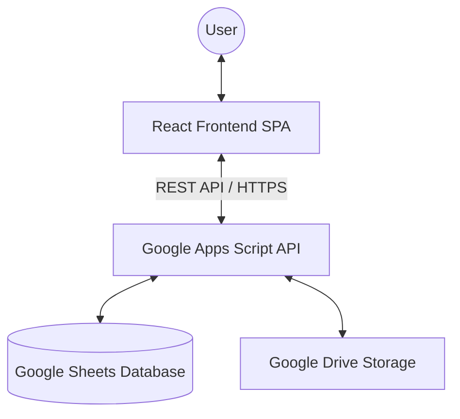
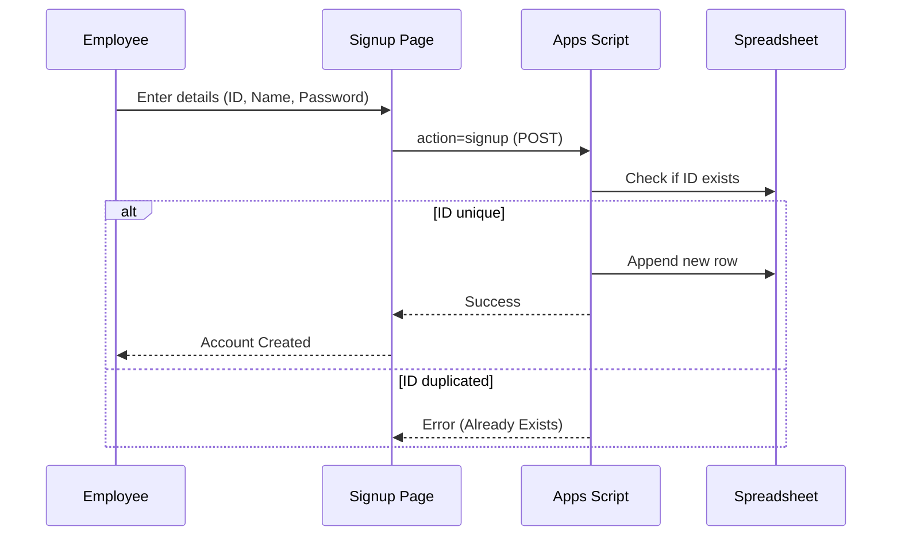
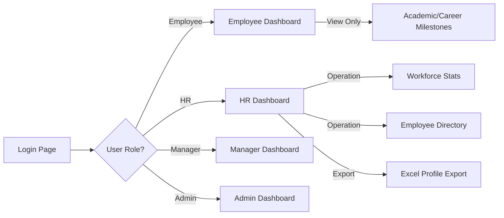

# Master Onboarding System Documentation

A comprehensive guide to the architecture, data flow, and micro-level processes of the Master Onboarding platform.

---

## 1. System Architecture
The project follows a **Serverless Full-Stack Architecture** leveraging the Google Cloud Ecosystem.

### Technical Stack:
- **Frontend**: React.js, Custom Vanilla CSS, Vite/NPM.
*   **API Layer**: Google Apps Script (Web App Deployment).
*   **Database**: Google Sheets (Relational data mapping).
*   **Storage**: Google Drive (Binary document storage).

---

## 2. Global Process Flow (Step-by-Step)

### A. The Registration Cycle

### B. The 7-Step Onboarding Engine
1.  **Stage 1: Identity Profile**: Employee inputs basic biodata (Name, DOB, Blood Group).
2.  **Stage 2: Domicile & Contact**: Captures current and permanent residence.
3.  **Stage 3: Academic Chronicle**: Records 10th, 12th, UG, and PG qualifications.
4.  **Stage 4: Professional Legacy**: Captures previous employment history and specialized trainings.
5.  **Stage 5: Family & Dependents**: Identity records for dependents (Aadhar/PAN).
6.  **Stage 6: Financial & Statutory**: Captures Bank details, PF, UAN, and ESI data.
7.  **Stage 7: Digital Vault (Uploads)**: User uploads 10+ documents directly to the Drive storage via Base64 encoding.

---

## 3. Data Flow: Micro-Level Breakdown

### File Upload Process:
1.  **Encoding**: The React frontend reads files via `FileReader API` and converts them to `Base64` strings.
2.  **Payload**: The `Base64` data is bundled into a JSON object and sent via `fetch` to the `.gs` endpoint.
3.  **Storage**: The Apps Script decodes the string, creates a file in a specific **Google Drive Folder**, and returns the `viewUrl`.
4.  **Indexing**: The `viewUrl` is stored in the corresponding column in Google Sheets.

### JSON Serialization in Sheets:
To handle complex arrays (like multiple jobs or degrees), the system serializes these arrays into **Stringified JSON** before saving to a single Google Sheet cell.
- **Example**: `[{"org": "A", "role": "Lead"}, {"org": "B", "role": "Dev"}]` is saved as text.
- **Retrieval**: The dashboard calls `JSON.parse()` to rebuild the interactive UI components.

---

## 4. Role-Based Access Control (RBAC) Flow

---

## 5. UI/UX Wireframe Concepts

### The "Bento Grid" Pattern
The dashboard uses a grid of cards (Bento Items) where:
- **Small Cards**: Qualitative stats (Joining Date, Gender).
- **Wide Cards**: Quantitative lists (Recent Hires, Address).
- **Large Cards**: Visual identity (Profile Photo, Hero Title).

### The "Milestone Track"
Academic and career history are rendered as **Vertical Timeline Paths**:
- **Nodes**: Representing specific years/milestones.
- **Connectors**: Representing the professional journey path.

---

## 6. Security Protocol
- **State Persistence**: Login status is managed via `localStorage` (EmployeeID + Session Flag).
- **URL Protection**: `useEffect` hooks in dashboard components verify if the session exists; otherwise, they redirect to the Login Portal.
- **Secure Storage**: Passwords are stored in a dedicated column, compared during the server-side authentication action.
